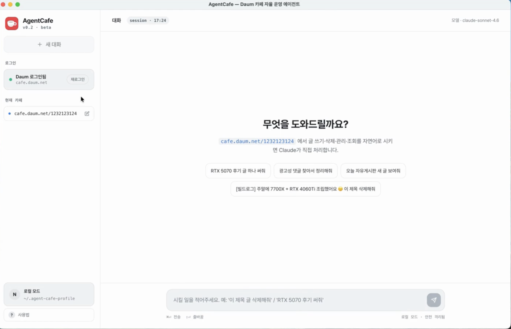

# AgentCafe

> **다음(Daum) 카페 운영자를 위한 AI 자동화 데스크톱 앱.**
> 매일 반복하는 일 — 글쓰기, 광고·스팸 댓글 정리, 댓글 달기, 글 삭제 — 을
> Claude AI가 브라우저를 직접 조작해서 대신 처리해 줍니다.



---

## 🎬 데모 영상


---

## ⬇️ 다운로드 & 설치 (macOS · Apple Silicon)

> M1/M2/M3 이상 Apple Silicon 맥 전용입니다.

**1. 설치파일 받기** → **[AgentCafe-0.1.0-arm64.dmg 다운로드](https://github.com/bobbypark-axz/AgentCafe/releases/latest)**
(GitHub에 로그인된 사내 계정으로 접속하면 보입니다. 비공개 저장소예요.)

**2. 설치**
1. 받으신 `.dmg` 파일을 더블클릭해서 열어주세요.
2. 안에 있는 **AgentCafe.app** 을 **응용 프로그램(Applications)** 폴더로 드래그합니다.

**3. "손상되었습니다" 메시지가 뜨는 경우만** 아래를 진행하세요.
(서명되지 않은 앱이라 macOS가 막는 것일 뿐, 정상입니다.)

3. **터미널** 앱을 실행합니다. (`⌘ + Space` → "터미널" 검색)
4. 아래 명령어를 복사해 붙여넣고 **Enter**:
   ```sh
   sudo xattr -rd com.apple.quarantine /Applications/AgentCafe.app
   ```
5. 맥북 암호를 입력하고 **Enter**.
   > 암호 입력 시 화면에 아무것도 안 보입니다. 그대로 입력 후 Enter 누르시면 됩니다.
6. 응용 프로그램 폴더에서 **AgentCafe** 를 더블클릭하면 실행됩니다.

---

## 🤔 이게 뭔가요? (배경)

다음 카페는 한국에서 여전히 활발한 커뮤니티지만, **운영자를 위한 자동화 도구가 사실상 없습니다.**
카카오(다음)가 공식 API를 제공하지 않아, 운영자는 매일 직접 글을 쓰고, 광고 댓글을
하나하나 지우고, 도배 글을 손으로 관리해야 합니다. 기존 매크로는 UI가 바뀔 때마다 깨지고요.

AgentCafe는 **Claude AI가 사람처럼 브라우저를 보고 클릭**하게 만들어 이 일을 대신합니다.
운영자가 **딱 한 번 로그인**하면, 이후엔 채팅창에 한국어로 시키기만 하면 됩니다.

---

## 👤 누구를 위한 건가요?

**1인 카페 운영자.**
회원 수천~수만 명 규모의 다음 카페를 혼자 운영하고, 본업이 따로 있어
글쓰기·댓글 관리·정리 작업에 쓸 시간이 부족한 분들을 위해 만들었습니다.

| 운영자의 부담 | AgentCafe가 대신 |
|---|---|
| 매일 글 안 쓰면 활동이 죽는다 | 카페 톤에 맞는 글을 **대신 작성·게시** |
| 광고·스팸 댓글 일일이 지우기 귀찮다 | 광고성 댓글을 **자동 감지·삭제** |
| 글마다 댓글 달아주기 번거롭다 | 자연스러운 **댓글 자동 작성** |
| 필요 없는 글 정리 | 글 **삭제** |

---

## ✅ 현재 지원 기능

- **광고성 댓글 자동 감지 및 삭제** — 본문·댓글에서 광고/스팸 패턴을 찾아 정리
- **글쓰기** — 카페 톤에 맞는 한국어 글을 작성해 게시
- **댓글 달기** — 글에 자연스러운 댓글 작성
- **글 삭제** — 제목/URL로 글을 찾아 삭제

---

## 🚀 사용법

1. **앱 실행** 후 사이드바의 **`로그인`** 버튼을 눌러 다음(Daum) 계정으로 로그인합니다.
   (운영하는 카페의 운영자 계정으로 로그인하세요. 최초 1회만 하면 됩니다.)
2. 사이드바의 **`현재 카페`** 에 작업할 카페 주소를 입력합니다.
   예) `https://cafe.daum.net/내카페이름`
3. 채팅창에 **한국어로 자연스럽게** 시키면 됩니다. Claude가 알아서 브라우저를 조작합니다.

**이렇게 말하면 됩니다:**
- `RTX 5070 후기 글 하나 써줘`
- `광고성 댓글 찾아서 정리해줘`
- `오늘 자유게시판 새 글 보여줘`
- `[빌드로그] 주말에 조립했어요 이 제목 삭제해줘`

작업하는 동안 **Chrome 창이 같이 떠서**, AI가 무엇을 클릭하는지 직접 보면서 확인할 수 있습니다.

---

## ⚠️ 주의사항

- 본인이 **운영자/회원인 카페**에서, 본인 계정으로만 사용하세요. 다음(카카오) 이용약관을 준수하세요.
- 삭제·정리 같은 작업은 **명시적으로 시켰을 때만** 실제로 실행됩니다.
- 캡차나 "의심스러운 접속" 화면이 뜨면 자동으로 멈추고 알려줍니다. 잠시 쉬었다 다시 시도하세요.
